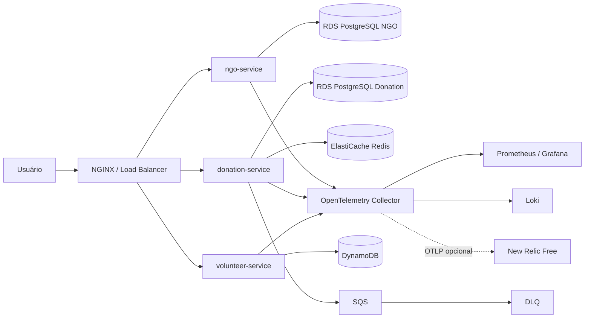
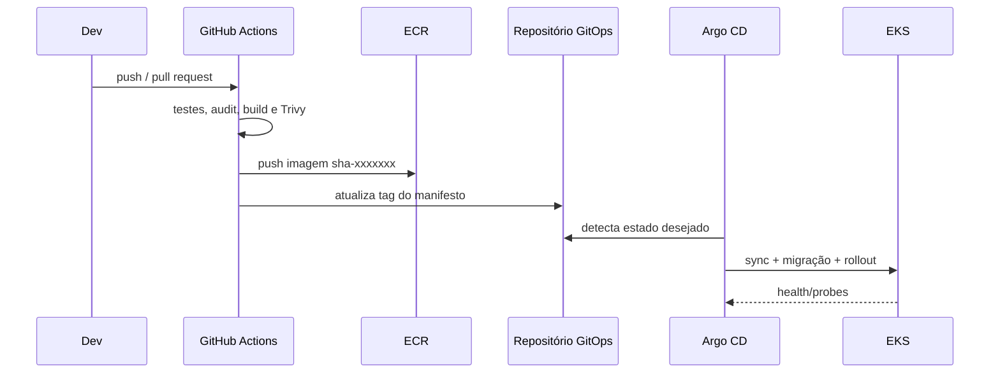

# Arquitetura da solução

## Visão lógica

O EKS está distribuído em duas sub-redes públicas para evitar NAT Gateway no laboratório. RDS e Redis ficam em sub-redes privadas, sem exposição pública. Essa concessão reduz custo no AWS Academy; em produção real, nodes devem ficar em sub-redes privadas com endpoints VPC ou NAT de alta disponibilidade.

## Decisões arquiteturais

- Serviços independentes e stateless: estado persistente está em serviços gerenciados.
- Banco por domínio: NGO e Donation não compartilham schema nem ciclo de mudança.
- Hot path protegido: Donation usa Redis, HPA, PDB e transactional outbox.
- Mensageria resiliente: SQS tem DLQ e criptografia gerenciada; o outbox oferece entrega ao menos uma vez e exige consumidores idempotentes.
- DynamoDB Global Table com GSI `ngo_id-index` e PITR: evita `Scan` ao consultar voluntários de uma ONG e mantém uma réplica na região DR.
- Imagens imutáveis: ECR rejeita sobrescrita e o GitOps usa tag vinculada ao SHA.
- Segurança: containers sem root, capabilities removidas, filesystem somente leitura, NetworkPolicies e secrets fora do Git.
- Operação declarativa: Terraform cria cloud e Argo CD converge o estado do cluster.

## 12-Factor App

| Fator | Aplicação neste projeto |
|---|---|
| Codebase | Monorepo versionado, serviços com builds independentes |
| Dependencies | `requirements.txt` e `go.mod/go.sum` |
| Config | Variáveis de ambiente, ConfigMaps e Secrets |
| Backing services | PostgreSQL, Redis, DynamoDB e SQS tratados como recursos anexados |
| Build/release/run | GitHub Actions → ECR → commit GitOps → Argo CD |
| Processes | Containers stateless; estado apenas nos serviços de dados |
| Port binding | Cada API expõe sua porta HTTP |
| Concurrency | Réplicas Kubernetes, HPA e workers Gunicorn |
| Disposability | Shutdown pelo runtime, probes e pods substituíveis |
| Dev/prod parity | Mesmas imagens; Compose emula dependências AWS localmente |
| Logs | JSON em stdout, coletado pelo OTel Collector |
| Admin processes | Migrações em Jobs PreSync idempotentes |

## Fluxo de entrega

## Limitações conscientes do laboratório

- RDS single-AZ e Redis single-node priorizam custo; produção requer Multi-AZ/failover.
- Prometheus, Grafana e Loki usam volumes efêmeros no Academy; produção deve usar EBS/S3 e retenção formal.
- A `LabRole` nos nodes é ampla. Em conta real, usar IRSA/EKS Pod Identity com privilégio mínimo.
- O DNS/TLS público depende de domínio e certificado que não fazem parte do laboratório; o Ingress funciona por endpoint do Load Balancer.
