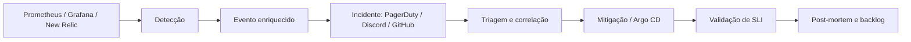

# ITSM, incidentes e AIOps

## Fluxo operacional

O alerta contém serviço, severidade, SLO afetado e link de dashboard. Labels iguais reduzem duplicidade. O AIOps proposto não toma decisões destrutivas: Kubernetes e Argo CD executam recuperação conhecida; o workflow apenas detecta, solicita reconciliação e abre registro auditável.

## Classificação

| Prioridade | Exemplo | Acknowledge | Comunicação |
|---|---|---:|---|
| P1 | Doações indisponíveis ou perda de dados | 10 min | atualização a cada 30 min |
| P2 | Latência degradada/error budget acelerado | 30 min | atualização horária |
| P3 | Falha sem impacto imediato | 1 dia útil | issue/backlog |

Papéis: Incident Commander coordena; Tech Lead mitiga; Communications mantém stakeholders informados; Scribe registra a linha do tempo. Em equipe pequena, uma pessoa pode acumular papéis, mas deve declarar isso no incidente.

## Configuração das integrações

1. Criar conta New Relic gratuita e obter ingest license key; seguir o [runbook de ativação do AIOps](NEW-RELIC-AIOPS.md) e passar a chave para `bootstrap-secrets.ps1`.
2. Criar serviço PagerDuty Free com integração Events API v2 e copiar a integration key. É a camada de ITSM: abre o incidente e sustenta o on-call.
3. Criar webhook do canal Discord, que é a camada de ChatOps, e um token GitHub com permissão de Contents para o `repository_dispatch` que aciona o self-healing. As três são camadas distintas e complementares, não alternativas entre si.
4. Passar as chaves ao script; nenhuma delas deve ser commitada.
5. Executar um alerta de teste e guardar screenshot/ID em `docs/evidencias/`.

Os defaults inertes do `bootstrap-secrets.ps1` existem apenas para que o provisionamento do Grafana não quebre caso uma chave falte: são sintaticamente válidos e não enviam incidentes. Um deploy que termine com esses valores tem Prometheus, Grafana e Loki funcionais, mas nenhuma notificação sai do cluster — confira os três parâmetros antes de rodar o bootstrap. Não foi incluído Datadog.

## Post-mortem mínimo

- Resumo e impacto mensurável.
- Linha do tempo com MTTD, acknowledge e MTTR.
- Causa técnica e fatores contribuintes, sem culpabilização.
- O que funcionou e o que atrasou a recuperação.
- Ações com dono, prazo e critério de conclusão.
- Ajustes em alerta, runbook, testes e error budget.
